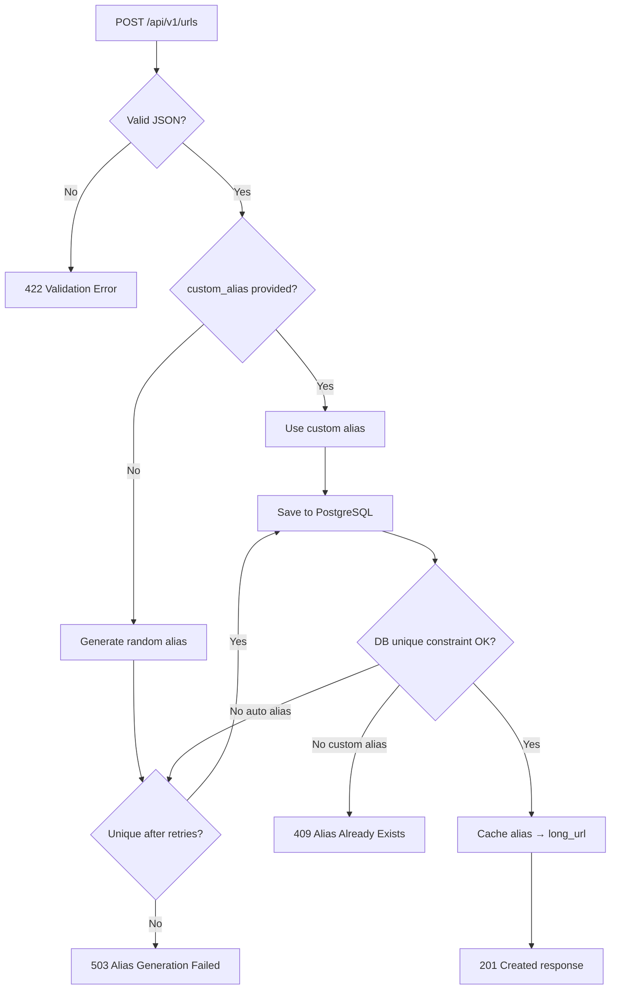

# URL Shortener API

Production-oriented REST API that shortens URLs, supports custom aliases with safe concurrent creation, redirects with an in-memory cache, and exposes link metadata. Persistent storage uses **PostgreSQL** (DigitalOcean Managed PostgreSQL in production).

## Architecture

```
app/
├── routers/        # HTTP handlers (thin)
├── services/       # Business logic
├── repositories/   # PostgreSQL access
├── models/         # SQLAlchemy entities
├── schemas/        # Pydantic request/response validation
├── db/             # Database session, SSL, in-memory cache
├── middleware/     # Request logging
├── config.py       # Environment-based settings
└── dependencies.py # FastAPI dependency injection
```

### Storage model

| Layer | Role |
|---|---|
| **PostgreSQL** | Source of truth — stores alias, long URL, access count, timestamps |
| **InMemoryUrlCache** | Speed layer — caches redirect targets and buffers hit counts |

Redis is not used. The in-memory cache is per-process; keep App Platform instance count at **1** while using it.

### Design trade-offs

| Decision | Why | Trade-off |
|---|---|---|
| DB unique constraint on `alias` | Correct collision handling under concurrency | Requires catching `IntegrityError` |
| In-memory redirect cache | Faster redirects, fewer DB reads on hot links | Cache is lost on restart; not shared across instances |
| Buffered hit counts | Fewer DB writes on every redirect | Access counts are eventually consistent until metadata is read |
| Async SQLAlchemy + asyncpg | Fits FastAPI concurrency model | SSL setup required for managed Postgres |
| 307 redirects | Preserves HTTP method on redirect | Some clients treat 302/307 differently |

## Requirements

- Python 3.12+
- PostgreSQL (DigitalOcean Managed PostgreSQL or local via Docker)

## Quick start

### 1. Configure environment

```bash
cd url-shortener
cp .env.example .env
# Edit .env with your DATABASE_URL and credentials
```

For **DigitalOcean Managed PostgreSQL**:
- Add your dev IP to **Databases → Settings → Trusted Sources**
- Set `DATABASE_SSL_VERIFY_CA=false` for local dev (no CA file needed)
- Set `DATABASE_SSL_VERIFY_CA=true` + `DATABASE_CA_CERT` for production

See [DEPLOY.md](./DEPLOY.md) for App Platform deployment.

### 2. Install and run

```bash
python -m venv .venv
source .venv/bin/activate
pip install -r requirements-dev.txt

./scripts/check-db.sh   # verify PostgreSQL connectivity
./scripts/run-dev.sh    # start on http://localhost:8000
```

### Option — local Postgres via Docker

```bash
docker compose --profile full up -d postgres
# Update DATABASE_URL in .env to point at localhost:5432
uvicorn app.main:app --reload
```

API docs: http://localhost:8000/docs

---

## API

### Create short URL

```http
POST /api/v1/urls
Content-Type: application/json

{
  "long_url": "https://example.com/very/long/path",
  "custom_alias": "optional-alias"
}
```

Response `201 Created`:

```json
{
  "alias": "optional-alias",
  "long_url": "https://example.com/very/long/path",
  "short_url": "http://localhost:8000/optional-alias",
  "access_count": 0,
  "created_at": "2024-01-01T00:00:00Z"
}
```

### Get metadata

```http
GET /api/v1/urls/{alias}
```

### Redirect

```http
GET /{alias}
```

Returns `307 Temporary Redirect` to the original URL.

**Testing redirects:** Swagger UI cannot follow redirects to external sites (browser CORS blocks it). Use one of:

- Browser address bar: `https://your-app.ondigitalocean.app/{alias}`
- curl: `curl -I https://your-app.ondigitalocean.app/{alias}`
- Swagger preview mode: `GET /{alias}?preview=true` → JSON with `redirect_url`
- Metadata API: `GET /api/v1/urls/{alias}` → includes `long_url`

### Health

```http
GET /health
```

---

## How it works

### Create URL flow



```
POST /api/v1/urls
       │
       ▼
CreateUrlRequest (Pydantic validation)
       │
       ▼
UrlService.create_short_url()
       │
       ├── custom_alias provided? ──Yes──► UrlRepository.create() ──► PostgreSQL
       │                                         │
       No                                        │ IntegrityError → 409
       ▼                                         ▼
_generate random alias (up to 5 retries)    InMemoryUrlCache.set_long_url()
       │                                         │
       └── collision ──► retry or 503            ▼
                                            201 Created response
```

#### Step 1 — Request validation

Handled by `CreateUrlRequest` before any business logic runs.

**`long_url`**

| Rule | Failure |
|---|---|
| Must be a valid HTTP/HTTPS URL (`AnyHttpUrl`) | `422` |

**`custom_alias`** (optional)

| Rule | Failure |
|---|---|
| 3–32 characters | `422` |
| Letters, numbers, hyphens, underscores only | `422` |
| Not a reserved word | `422` |
| Whitespace trimmed | — |

Reserved aliases: `api`, `docs`, `health`, `openapi`, `redoc`, `metrics`, `admin`

#### Step 2 — Custom alias path

When `custom_alias` is provided:

1. Insert into PostgreSQL with the given alias.
2. On duplicate alias → `409 Conflict` (no retry).
3. On success → cache the mapping and return `201`.

The database enforces uniqueness via a unique index on `alias`. Concurrent requests that race for the same alias are resolved safely by catching `IntegrityError`.

#### Step 3 — Auto-generated alias path

When `custom_alias` is omitted:

1. The configured **alias strategy** generates the alias (see below).
2. Skip if the alias matches a reserved word (random strategy only; base62 handles via offset).
3. Attempt insert into PostgreSQL.
4. On collision → retry up to `AUTO_ALIAS_MAX_RETRIES` times (random strategy only).
5. If all retries fail → `503 Service Unavailable`.

#### Alias generation strategies

Configured via `AUTO_ALIAS_STRATEGY` (`random` or `base62`).

| Strategy | Env value | How the alias is produced |
|---|---|---|
| **Random** (default) | `random` | `secrets`-based random string, length = `AUTO_ALIAS_LENGTH` (default 8) |
| **Base62** | `base62` | PostgreSQL autoincrement `id` encoded as Base62, padded to `AUTO_ALIAS_LENGTH` |

Base62 example: record `id=5` with `AUTO_ALIAS_LENGTH=3` → alias `005`.

```env
AUTO_ALIAS_STRATEGY=base62
AUTO_ALIAS_LENGTH=3
```

#### Step 4 — Cache and response

After a successful insert:

- `InMemoryUrlCache.set_long_url(alias, long_url)` stores the mapping for fast redirects.
- Response includes `short_url` built from `BASE_URL/{alias}`.

#### Example outcomes

| Request | Result |
|---|---|
| Valid URL, no alias | `201` with random alias |
| Valid URL + custom alias | `201` with that alias |
| Invalid URL | `422` |
| Alias too short / bad characters | `422` |
| Reserved alias (`health`, `api`, …) | `422` |
| Custom alias already taken | `409` |
| Auto alias: 5 collisions in a row | `503` |

---

### Redirect flow

```
GET /{alias}
       │
       ▼
UrlService.resolve_redirect()
       │
       ├── cache hit? ──Yes──► increment buffered hits ──► 307 redirect
       │
       No
       ▼
UrlRepository.get_by_alias() ──► PostgreSQL
       │
       ├── not found ──► 404
       │
       └── found ──► cache alias ──► increment hits ──► 307 redirect
```

- Redirects use **307 Temporary Redirect** so the HTTP method is preserved.
- Hit counts are buffered in memory on each redirect (not written to DB immediately).
- Cache entries expire after `REDIRECT_CACHE_TTL_SECONDS` (default 3600).

---

### Metadata flow

```
GET /api/v1/urls/{alias}
       │
       ▼
UrlService.get_metadata()
       │
       ├── alias not in DB ──► 404
       │
       └── found ──► flush buffered hits to PostgreSQL
                     ──► return alias, long_url, short_url, access_count, created_at
```

Reading metadata flushes any pending buffered hit counts from the in-memory cache into PostgreSQL, so `access_count` reflects recent redirects.

---

## Error handling

| Status | Scenario |
|---|---|
| `201` | URL created |
| `307` | Redirect |
| `404` | Unknown alias |
| `409` | Custom alias collision |
| `422` | Invalid input (bad URL, bad alias, reserved alias) |
| `503` | Could not generate unique auto alias after retries |

---

## Environment variables

See `.env.example` for all settings.

| Variable | Description |
|---|---|
| `DATABASE_URL` | PostgreSQL connection string (auto-converted to `postgresql+asyncpg://`) |
| `DATABASE_SSL_REQUIRED` | Enable SSL for managed Postgres (`true`) |
| `DATABASE_SSL_VERIFY_CA` | `false` = encrypt only (local dev); `true` = verify-full (production) |
| `DATABASE_CA_CERT` | PEM content for verify-full; use `${defaultdb.CA_CERT}` on App Platform |
| `BASE_URL` | Public base URL for generated short links |
| `AUTO_ALIAS_STRATEGY` | Alias generation strategy: `random` or `base62` (default `random`) |
| `AUTO_ALIAS_LENGTH` | Random alias length, or Base62 minimum length (default 8) |
| `AUTO_ALIAS_MAX_RETRIES` | Max collision retries for auto aliases (default 5) |
| `REDIRECT_CACHE_TTL_SECONDS` | In-memory cache TTL (default 3600) |

---

## Testing

```bash
pytest                  # all tests
pytest tests/unit       # unit tests (no DB required)
pytest -m integration   # integration tests (requires live PostgreSQL)
pytest --cov=app
```

Unit tests cover alias validation and service logic with mocks. Integration tests verify create, redirect, collision handling, and health checks against PostgreSQL.

---

## Deployment

See [DEPLOY.md](./DEPLOY.md) for DigitalOcean App Platform setup, environment variables, and SSL configuration.

## Run with Docker

```bash
docker compose up --build
```
